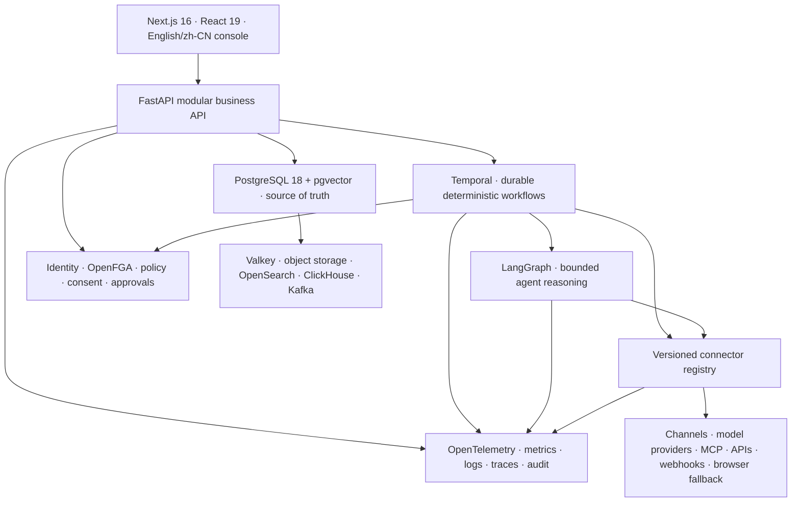

# Grovello architecture

Grovello is one Growth OS, not a bundle of AI utilities. It turns shared business truth into governed execution and writes revenue, margin, retention, attribution, and experiment evidence back into the next decision cycle.

## Positioning hierarchy

```text
Enterprise Growth OS
└─ Global Go-to-Market & Revenue Growth
   └─ First golden acceptance journey: Global B2B Growth
      └─ Replaceable reference fixture: fictional Northstar Industrial workspace entering the German B2B market
```

The hierarchy separates product scope from acceptance specificity. Grovello supports domestic and international enterprise growth. The first golden journey makes one complete global B2B loop measurable; it does not turn the product into a foreign-trade suite or hard-code an industry, an origin country, or a destination market.

Canonical domain objects stay general: `Product`, `Offer`, `Market`, `ICP`, `Account`, `Contact`, `Lead`, `Opportunity`, `Quote`, `Contract`, `Order`, `Invoice`, `Payment`, `Customer`, `Renewal`, and `AttributionResult`. Industry and cross-border specifics are modeled through data, policies, taxonomies, connector configuration, and installable templates.

## Product tree

```text
Grovello
├─ Growth Command
│  ├─ overview and system architecture
│  ├─ growth journeys and golden-path readiness
│  ├─ goals, budgets, decisions, battle plans
│  └─ risk-based approvals
├─ Brand & Market
│  ├─ brand rules, products, offers, proof
│  ├─ markets, localization, ICP, buying committees
│  └─ enterprise knowledge and digital assets
├─ Content & Traffic
│  ├─ content factory and page factory
│  ├─ SEO and GEO
│  ├─ video matrix
│  └─ governed publishing
├─ Channels & Advertising
│  ├─ account matrix and channel health
│  ├─ social operations
│  └─ paid media, creative tests, and budgets
├─ Leads & Outreach
│  ├─ account/contact discovery and enrichment
│  ├─ email and multichannel sequences
│  └─ unified inbox and customer timeline
├─ Customers & Revenue
│  ├─ CRM, opportunities, forecasting
│  ├─ AI-assisted selling and meetings
│  └─ quotes, contracts, orders, invoices, payments
├─ Customer Growth
│  ├─ onboarding, adoption, and health
│  ├─ retention and renewal
│  └─ expansion, advocacy, and referrals
├─ Data & Intelligence
│  ├─ canonical identities, events, metrics, lineage
│  ├─ attribution, reports, forecasts
│  ├─ experiments
│  └─ market and competitive intelligence
├─ Automation Runtime
│  ├─ runs, tasks, durable workflows
│  ├─ agents, model router, evaluations
│  └─ connectors, templates, APIs, webhooks, MCP
└─ Organization & Governance
   ├─ organizations, workspaces, teams, access
   ├─ consent, suppression, privacy, safety
   └─ secrets, policies, and audit events
```

## Operating loop


## First golden journey: Global B2B Growth

```mermaid
flowchart LR
    A["Business onboarding"] --> B["Brand · product · offer · evidence"]
    B --> C["Market · ICP · goals · budget"]
    C --> D["Intelligence · AI strategy · approval"]
    D --> E["Content · search · media · outbound"]
    E --> F["Accounts · contacts · leads · conversations"]
    F --> G["Qualification · meetings · opportunities"]
    G --> H["Quotes · contracts · orders · payments"]
    H --> I["Success · renewal · expansion · referral"]
    I --> J["Attribution · margin · retention · experiments"]
    J --> C
```



The fictional Northstar Industrial fixture uses an industrial automation offer because its longer B2B buying cycle exercises evidence, buying committees, multichannel outreach, technical qualification, quotes, contracts, payments, and customer success. The same journey must pass with another B2B product, service, or software offer by replacing configuration and seed data only.

Cross-border B2C commerce is a distinct future golden journey because catalog, cart, checkout, tax, fulfillment, returns, and marketplace settlement create a materially different transaction lifecycle. Shared growth capabilities can serve it, but Grovello must not claim B2C loop completion until those commerce-specific stages are operational.

## Runtime layers



### Boundary rules

1. Next.js owns the product experience, localization, session surface, and thin BFF behavior. It never becomes the business source of truth.
2. FastAPI owns versioned business contracts and application services. The backend begins as a modular monolith; workers deploy independently.
3. PostgreSQL owns canonical transactional state. Valkey, vector indexes, search, analytics, and event projections are disposable and rebuildable.
4. Temporal owns timers, retries, compensation, cancellation, and long-running approval state. LangGraph does not replace it.
5. LangGraph owns bounded reasoning graphs, tool choice, evaluation, and agent interruption. It does not own orders, payments, or workflow durability.
6. Connectors are versioned provider-neutral adapters. Official API/webhook access precedes controlled Playwright fallback.
7. MCP is one tool protocol. It does not replace transactional APIs, webhooks, databases, or event streams.
8. External writes pass authorization, policy, consent, suppression, budget, and approval gates before execution.

## Data and event model

Every tenant-owned record has a `workspace_id`. Core records carry actor, purpose, run, idempotency key, input/model/tool/connector versions, approval, cost, outcome, failure, lineage, and timestamps. A transactional outbox records integration events in the same transaction as business writes. Kafka and Debezium are enabled when several durable consumers justify streaming; they are not a second source of business truth.

The identity graph links anonymous visitors, contacts, accounts, leads, opportunities, customers, conversations, orders, and revenue events without copying conflicting customer records into every module.

## Deployment evolution

```text
Local / evaluation
  Compose: web + API + worker + PostgreSQL/pgvector + Valkey + Temporal + gateway

Production single-region
  Managed or HA PostgreSQL + S3 + Keycloak/OIDC + OpenFGA + OpenTelemetry
  Separate web/API/workers; horizontal worker queues by capability and risk

Large scale / multi-region
  Kubernetes + Helm + KEDA + Argo CD + OpenTofu
  OpenSearch for retrieval, ClickHouse for analytics, Kafka/Debezium for event distribution
  Regional data policies, connector egress controls, workload isolation, disaster recovery
```

No later scale tier changes the domain model or the workflow/agent/connector contracts.
