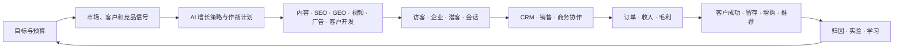
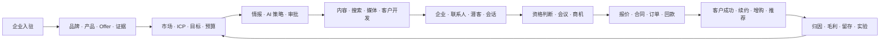
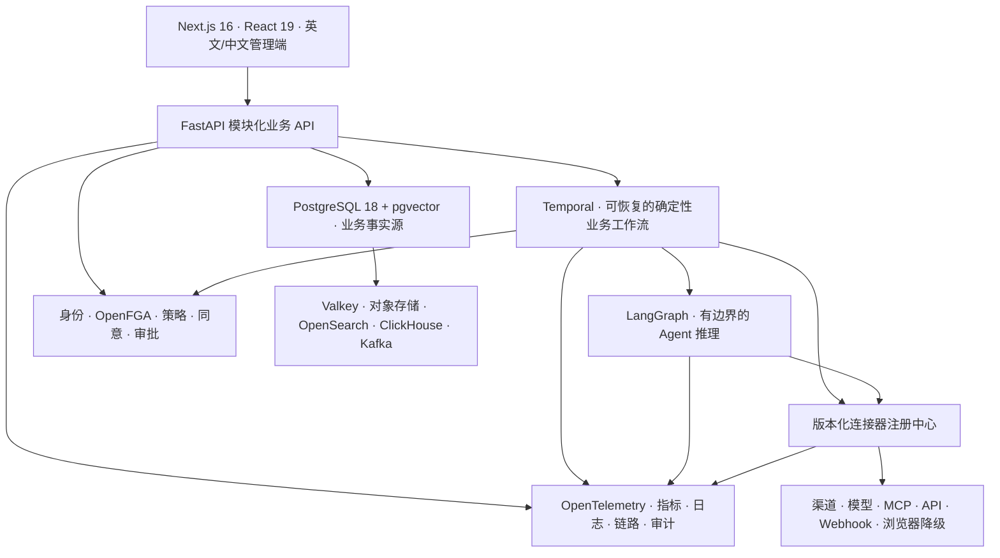

# Grovello 系统架构

Grovello 是一套完整的企业增长操作系统，不是一组互不关联的 AI 工具。它把共享业务事实转化为受治理的执行，并将收入、毛利、留存、归因和实验结果写回下一轮决策。

## 定位层级

```text
企业增长操作系统（Enterprise Growth OS）
└─ 全球市场拓展与营收增长（Global Go-to-Market & Revenue Growth）
   └─ 第一条黄金验收闭环：全球 B2B 增长（Global B2B Growth）
      └─ 可替换参考数据：虚构的北辰工业工作区进入德国 B2B 市场
```

这套层级把产品边界与验收场景区分开来。Grovello 服务国内和全球市场的企业增长；第一条黄金闭环只是用一个具体场景验收完整能力，不会把产品缩成“外贸软件”，也不会写死行业、来源国或目标市场。

规范领域对象保持通用：`Product`、`Offer`、`Market`、`ICP`、`Account`、`Contact`、`Lead`、`Opportunity`、`Quote`、`Contract`、`Order`、`Invoice`、`Payment`、`Customer`、`Renewal` 和 `AttributionResult`。行业与跨境差异通过业务数据、策略、分类、连接器配置和可安装模板表达。

## 产品功能树

```text
Grovello
├─ 增长指挥中心
│  ├─ 总览与系统架构
│  ├─ 增长闭环与黄金路径就绪度
│  ├─ 目标、预算、AI 决策、增长作战计划
│  └─ 基于风险的审批
├─ 品牌与市场
│  ├─ 品牌规则、产品、Offer、案例与证明
│  ├─ 目标市场、本地化、ICP 与决策链
│  └─ 企业知识与数字资产
├─ 内容与流量
│  ├─ 内容工厂与网站/落地页工厂
│  ├─ SEO 与 GEO
│  ├─ 视频矩阵
│  └─ 受治理的多渠道发布
├─ 渠道与广告
│  ├─ 渠道账号矩阵与健康状态
│  ├─ 社交媒体运营
│  └─ 付费广告、素材实验与预算
├─ 潜客与开发
│  ├─ 企业/联系人发现、补全、验证
│  ├─ 邮件与多渠道开发序列
│  └─ 统一收件箱与客户时间线
├─ 客户与收入
│  ├─ CRM、商机、预测
│  ├─ AI 辅助销售与会议
│  └─ 报价、合同、订单、发票、回款
├─ 客户增长
│  ├─ 入驻、采用与客户健康
│  ├─ 留存与续约
│  └─ 增购、倡导与推荐
├─ 数据与智能
│  ├─ 统一身份、事件、指标与血缘
│  ├─ 收入归因、报表与预测
│  ├─ 增长实验
│  └─ 市场与竞品情报
├─ 自动化运行时
│  ├─ Run、任务与持久工作流
│  ├─ Agent、模型路由与评估
│  └─ 连接器、模板、API、Webhook、MCP
└─ 组织与治理
   ├─ 组织、工作区、团队与权限
   ├─ 同意、退订、隐私与安全
   └─ 密钥、策略与审计事件
```

## 增长闭环



## 第一条黄金验收闭环：全球 B2B 增长



虚构的北辰工业参考数据采用工业自动化产品，因为它较长的 B2B 决策链能够同时验证证据、购买委员会、多渠道开发、技术资格判断、报价、合同、回款与客户成功。替换配置和种子数据后，同一条闭环必须可以验收其他 B2B 实体产品、专业服务或软件产品，不能修改规范领域模型。

跨境 B2C 电商应当作为未来独立的黄金闭环，因为商品目录、购物车、结账、税务、履约、退货和平台结算构成了不同的交易生命周期。共享增长能力可以服务 B2C，但在这些电商专属环节真正可运行以前，Grovello 不能声称已经完成 B2C 闭环。

## 技术运行分层



### 不可混淆的边界

1. Next.js 负责产品体验、国际化、会话界面和薄 BFF，不保存业务真相。
2. FastAPI 负责版本化业务契约与应用服务。后端先采用模块化单体，Worker 可独立部署。
3. PostgreSQL 是规范化事务事实源；缓存、向量、搜索、分析和事件投影都必须可重建。
4. Temporal 负责定时器、重试、补偿、取消和长期审批状态；LangGraph 不能替代它。
5. LangGraph 负责有边界的推理图、工具选择、评估和 Agent 级人工中断；它不管理订单、回款和工作流耐久性。
6. 连接器是版本化、供应商中立的适配器。优先使用官方 API/Webhook，Playwright 只作受控降级。
7. MCP 是 Agent 工具协议之一，不替代事务 API、Webhook、数据库与事件流。
8. 外部写入必须依次通过授权、策略、同意/退订、预算和审批门禁。

## 数据与事件

所有租户业务表必须包含 `workspace_id`。关键记录必须带有操作者、业务目的、Run、幂等键、输入/模型/工具/连接器版本、审批状态、成本、结果、失败、血缘和时间戳。事务 Outbox 与业务写入同事务记录事件；只有出现多个持久消费者时才启用 Kafka/Debezium，Kafka 不是第二业务事实源。

统一身份图连接匿名访客、联系人、企业、潜客、商机、客户、会话、订单与收入事件，避免各功能模块保存互相冲突的客户副本。

## 部署演进

```text
本地/评估：Compose 启动 Web、API、Worker、PostgreSQL/pgvector、Valkey、Temporal、网关
单区域生产：高可用数据库与对象存储、OIDC/Keycloak、OpenFGA、OpenTelemetry，按风险与能力拆分 Worker 队列
大规模/多区域：Kubernetes、Helm、KEDA、Argo CD、OpenTofu；按需启用 OpenSearch、ClickHouse、Kafka/Debezium
```

规模升级不会改变领域模型，也不会推翻工作流、Agent 和连接器契约。
